# A gentle Warthog guide
## Compiling Warthog from source
### Installing required packages
Before we can start make sure you have a recent Linux distribution. In this guide we are using Ubuntu 22.04.3 LTS. We need to update our package manager and install `git`, `build-essential`, `meson` and `ninja-build`:
```
sudo apt update
sudo apt install git
sudo apt install build-essential meson ninja-build
```
<p align="center">
  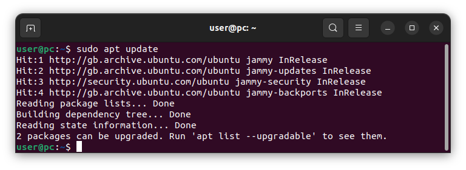
</p>
<p align="center">
  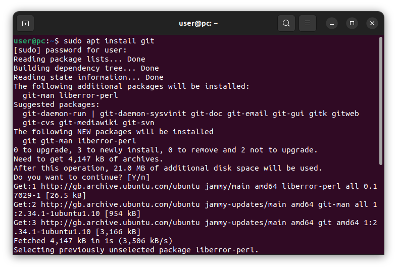
</p>
<p align="center">
  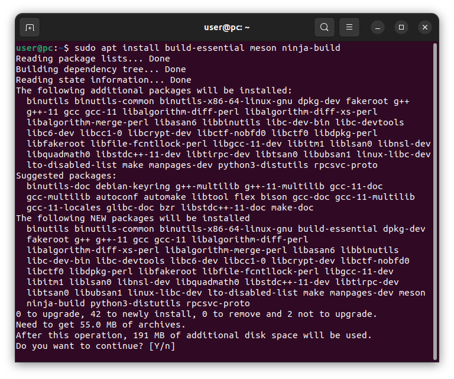
</p>


### Cloning the Repo
Now that we have git we can clone the Warthog repository from GitHub:
```
git clone https://github.com/warthog-network/Warthog
```
<p align="center">
  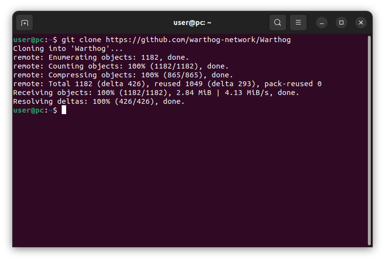
</p>

### Compiling
A new directory should be created, let's `cd` into it and run `meson build` to create a build directory named `build`:
```
cd Warthog
meson build
```
<p align="center">
  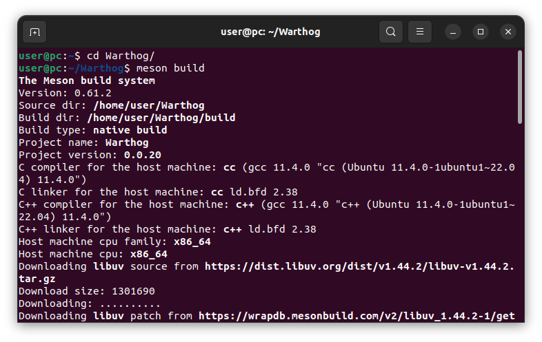
</p>

When you run the `meson build` command for the first time some extra dependencies will be downloaded so it might take a while.  Now we have a build directory within the Warthog directory so we `cd` into it and start compilation with `ninja`:
```
cd build
ninja
```
<p align="center">
  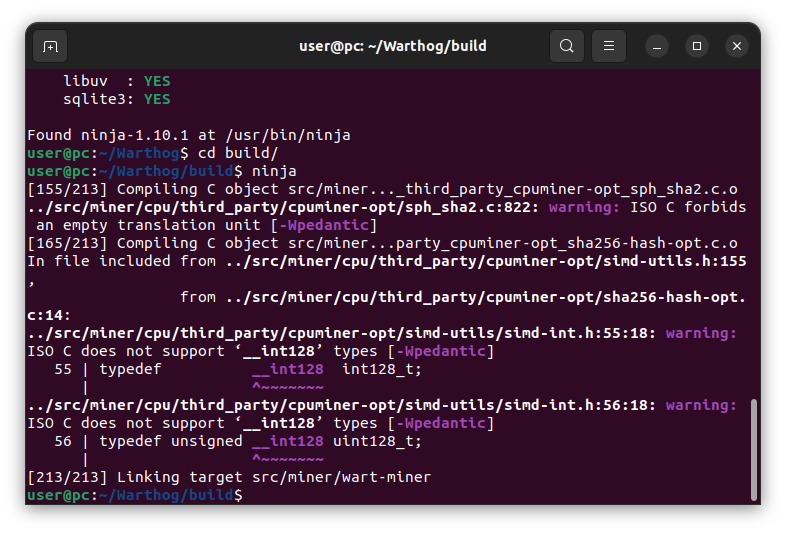
</p>

Congratulations! You now have compiled the Warthog C++ source. But wait - there is a problem: we did not enable compiler optimizations. In `meson` compiler optimizations need to be explicitly enabled with the `--buildtype=release` flag. Then the compiled executables and libraries will be more efficient. This is important for mining because you will get better hashrate with optimized compilation. 

So let's do this again, we will go up one directory and delete the build directory again. Then we recreate it but this time with the `--buildtype=release` option and compile again with `ninja`:

```
cd ..
rm -rf build
meson build --buildtype=release
cd build
ninja
```
Note that now meson reports it has set `buildtype: release`.
<p align="center">
  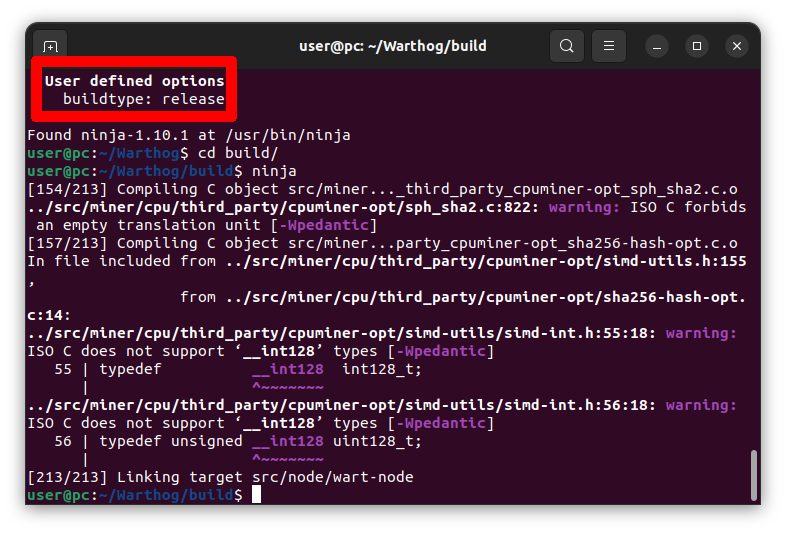
</p>

After compilation finished successfully we can have a look at the compiled artifacts: Warthog currently compiles a node, a wallet and a miner. They are generated in the `src` directory within the build directory. Have a look:
```
cd src/
ls
```
<p align="center">
  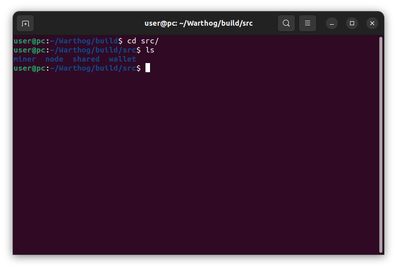
</p>

## Starting the node

Now `cd` into the node directory and view its contents:
```
cd ~/Warthog/build/src/node/
ls
```
There is the node named `wart-node`, let's start it:
```
./wart-node
```
<p align="center">
  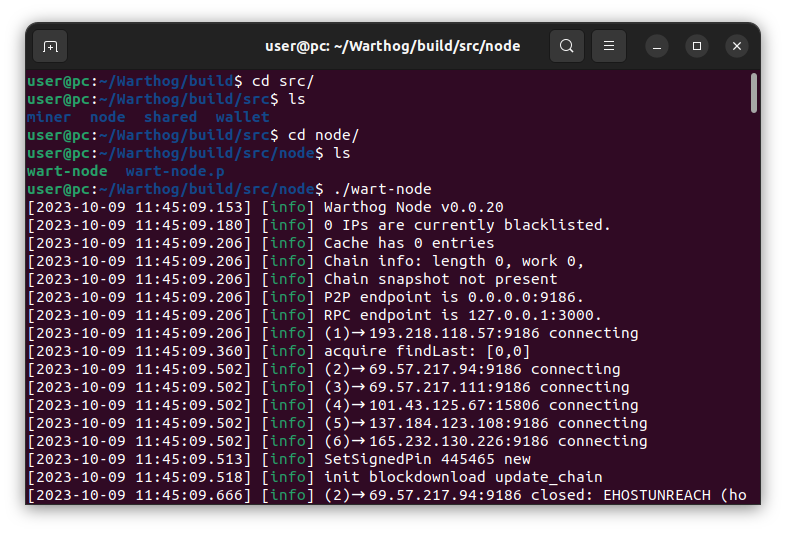
</p>

The node starts syncing. The node needs to be running and synced while we are using the wallet and miner.

## Using the wallet
Below we will explain how to create a wallet file and send coins.
Go to into the wallet directory and check the contents.
```
cd ~/Warthog/build/src/wallet/
ls
```
You should see an executable named `wart-wallet`. Now let's create a new wallet
```
./wart-wallet -c
```
A new wallet called `wallet.json` file is created. It is not encrypted and other programs on your computer can steal it. Back it up. Don't show it to anyone. The private key can be used to restore the wallet. 
To print your address use the command 
```
./wart-wallet -a
```

Now let's send some coins:
```
./wart-wallet -s
```
The wallet asks for the address you want to send to, the fee and the amount. You can type in values like these:
Then confirm with "y" and press enter. Of course you cannot send because your wallet address has no coins yet.

<p align="center">
  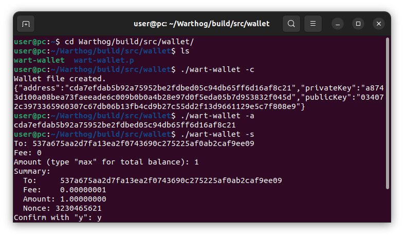
</p>

For more information on how to use the wallet read the `--help` section:
```
./wart-wallet --help
```
<p align="center">
  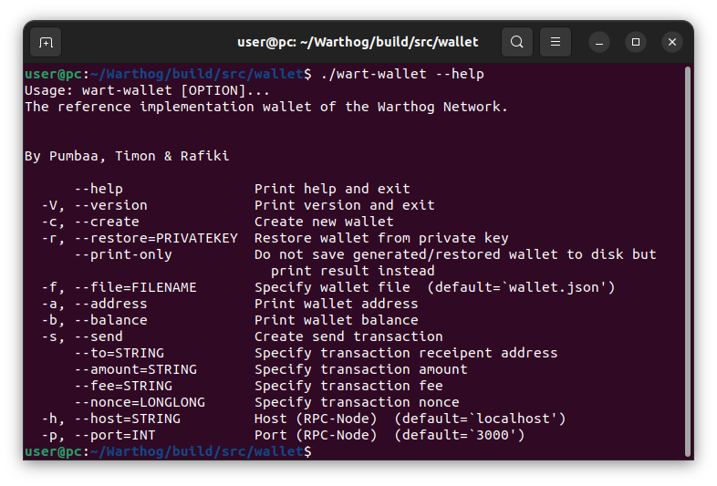
</p>

## Using the miner
**Note**: For efficient mining you should have compiled the source code with the meson option `--builtype=release` as explained above. 

First `cd` into the miner directory and check its contents:
```
cd ~/Warthog/build/src/miner/
ls
```
The miner executable is called "`wart-miner`". 
### CPU mining
To start mining on CPU you have to supply an address it shall mine to. Furthermore you need to have the node program running in another terminal. The command to mine to the address `537a675aa2d7fa13ea2f0743690c275225af0ab2caf9ee09` is 
```
./wart-miner -a 537a675aa2d7fa13ea2f0743690c275225af0ab2caf9ee09
```
You need to place your own address into this command.

The miner runs until you stop it with CTRL+C.

<p align="center">
  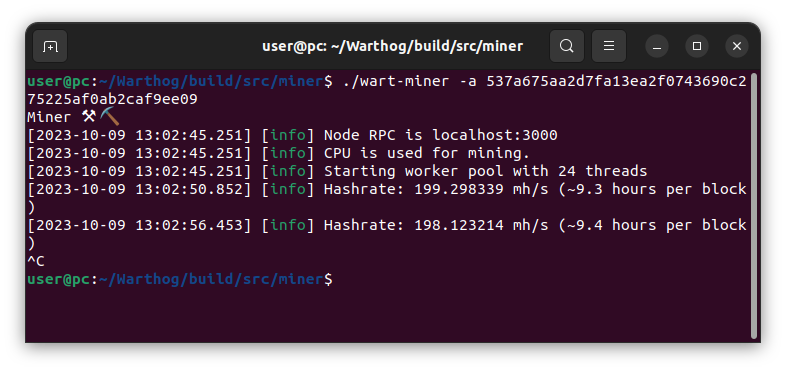
</p>

By default only the miner compiles only CPU mining functionality. However GPUs are more efficient for mining Warthog, and CPU should not be used for mining. 

### GPU mining
To enable GPU mining we have to configure the build directory:
```
cd ~/Warthog/build/
meson configure -Denable-gpu-miner=true
```

Now `ninja` executed in the build directory will emit an error because you do not have OpenCL installed. Furthermore meson needs `pkg-config` to locate the OpenCL headers. Install these dependencies with this command:
```
sudo apt-get install opencl-headers ocl-icd-opencl-dev pkg-config
```
Now we can compile again with GPU miner support:
```
cd ~/Warthog/build/
meson configure -Denable-gpu-miner=true
```
Compilation should succeed now and meson "`User defined options`" should list "`enable-gpu-miner: true`".

To mine on your GPUs you still need to do one thing: you need to install  GPU drivers with OpenCL support.

You can check if your GPU has a working OpenCL support with the `clinfo` command. Install this program with 
```
sudo apt install clinfo
```
Then start it by typing
```
clinfo
```
In our case we don't have any GPU drivers installed that support OpenCL:

<p align="center">
  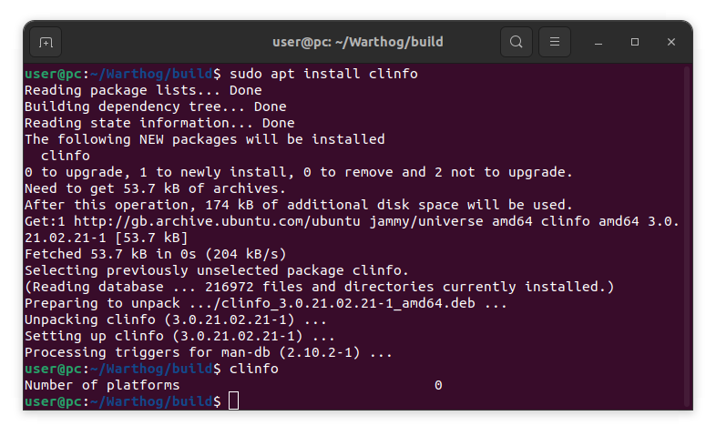
</p>

The installation procedure depends on your GPU vendor. 

### AMD GPUs

Our GPU is an AMD Radeon RX 5600 XT but `clinfo` does not detect any OpenCL installation for it yet. Visit the AMD support site [https://www.amd.com/en/support]() and select the GPU model:

<p align="center">
  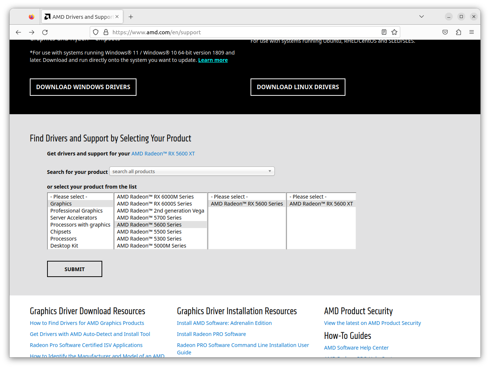
</p>

<p align="center">
  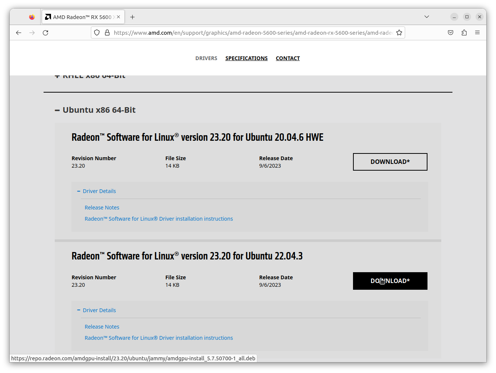
</p>

Then we need to install the downloaded `deb` package.

<p align="center">
  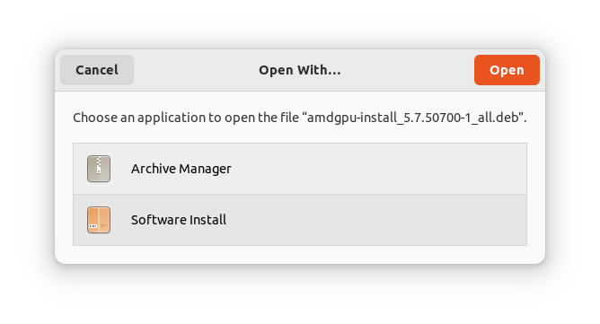
</p>

<p align="center">
  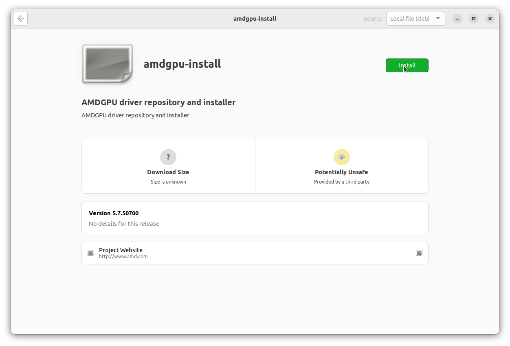
</p>

```
sudo amdgpu-install --usecase=workstation,rocm,opencl --opencl=rocr,legacy --vulkan=pro --accept-eula
```

This will command will take a while downloading and installing more than 2GB worth of packages.

Now try `clinfo` agian:

<p align="center">
  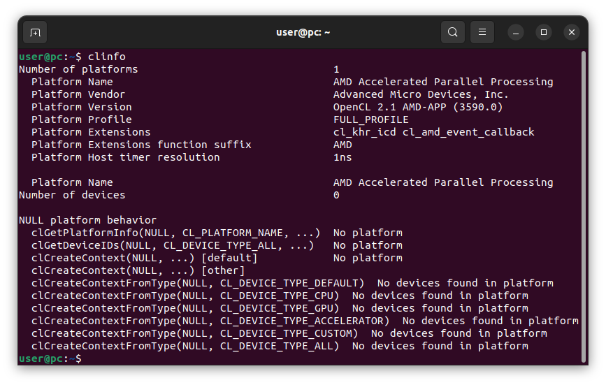
</p>

The AMD OpenCL platform is now detected but there are no devices. This is because you need to add your user to the `render` group:

```
sudo adduser $USER render
```
Now reboot your system. If you try `clinfo` again you now see the GPU device:

<p align="center">
  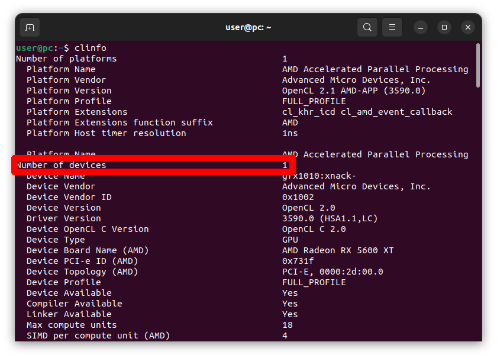
</p>

The warthog miner can now mine in GPU mode:

<p align="center">
  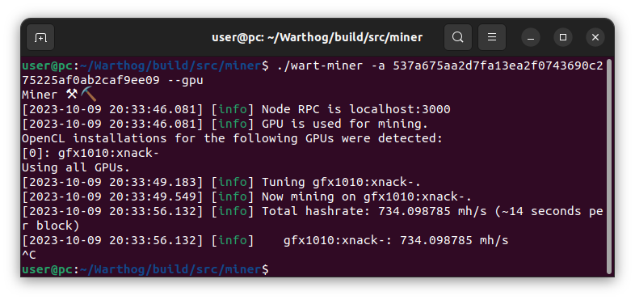
</p>

### NVIDIA GPUs
First download your driver from [https://www.nvidia.de/Download/index.aspx?lang=en-us]() by selecting your GPU model and clicking on "Aggree Download".
<p align="center">
  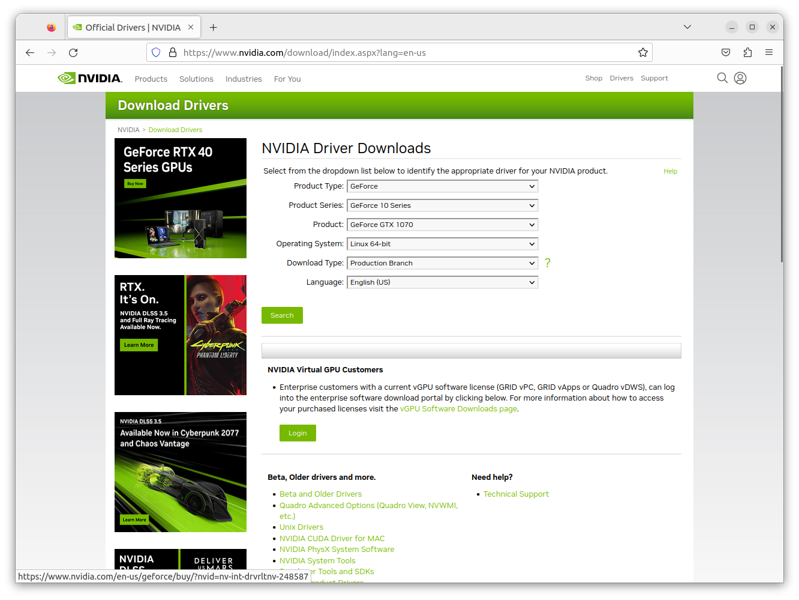
</p>

<p align="center">
  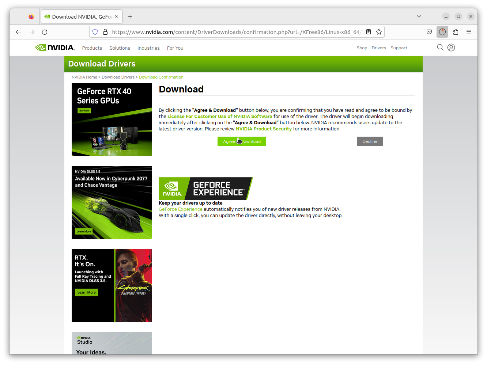
</p>

The downloaded file is a `sh` script and we need to make it executable. So we navigate to the `Downloads` directory and execute 
```
chmod a+x NVIDIA-Linux-x86_64-535.112.01.run
```
Of course you need to insert your exact filename here.
<p align="center">
  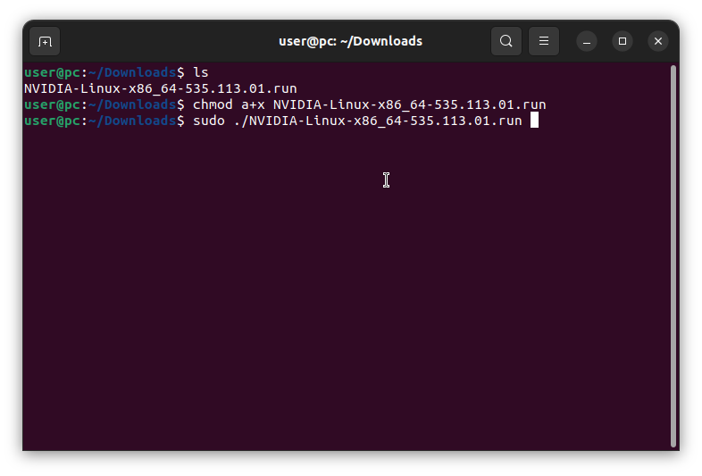
</p>
 When we try to run it via
```
sudo ./NVIDIA-Linux-x86_64-535.112.01.run
```
we get this error:
<p align="center">
  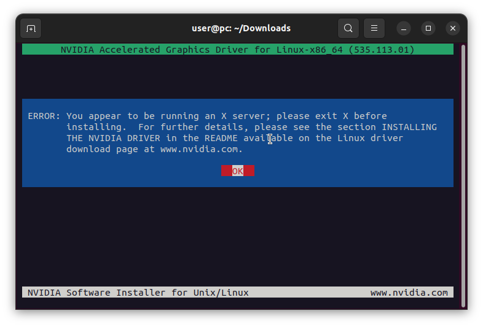
</p>

This means we need to execute the script no a lower run level without an X server running. In addition we must blacklist the default `nouvaeu` driver with this command:
```
echo -e "blacklist nouveau\noptions nouveau modeset=0" | sudo tee /etc/modprobe.d/blacklist-nouveau.conf
```
Now reboot your system. Once rebooted you should switch to a lower run level.
To do this press the three keys CTRL + ALT + F3 at the same time.
You should see a black screen with login prompt like this:
```
Ubuntu 220.4.3 LTS pc tty3

pc login: _
```
Log in with your user name and password and then switch to a lower run level with 
```
sudo init 3
```
You can now start the installation as above, navigate to the `Downloads` directory and start the installation:
```
cd ~/Downloads
sudo ./NVIDIA-Linux-x86_64-535.112.01.run
```

You should see these screens, just select "Confirm installation", then "Yes", "Yes", "OK".


<p align="center">
  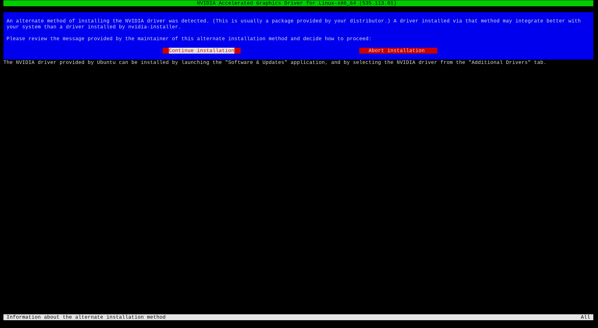
</p>

<p align="center">
  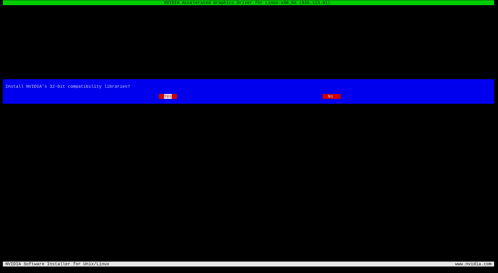
</p>


<p align="center">
  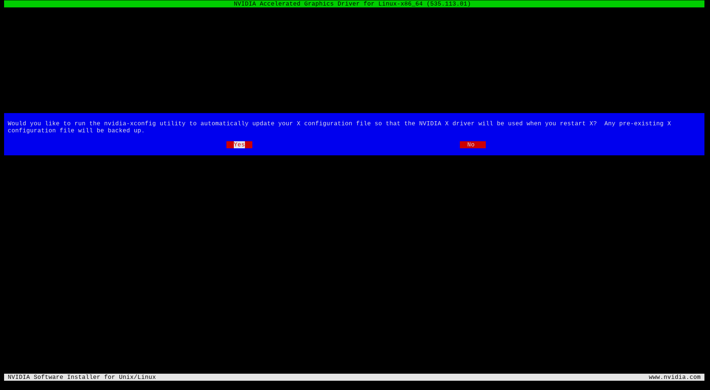
</p>

<p align="center">
  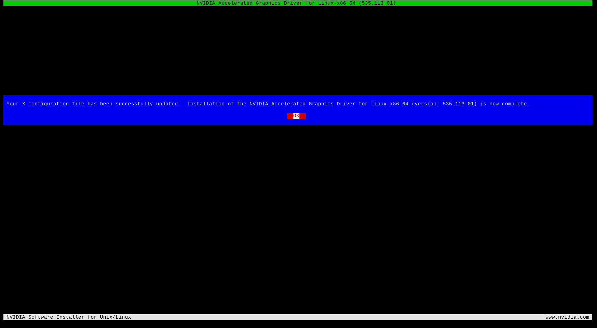
</p>

Now that the NVIDIA driver installation is complete restart your system again you should be able to see your device in the `clinfo` command:
<p align="center">
  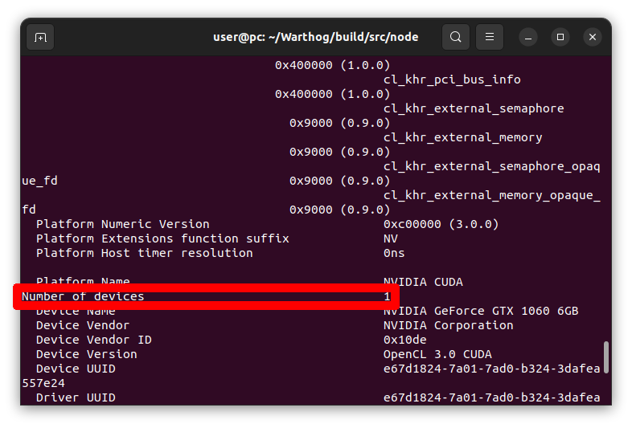
</p>

Now you can mine on your NVIDIA GPU!
<p align="center">
  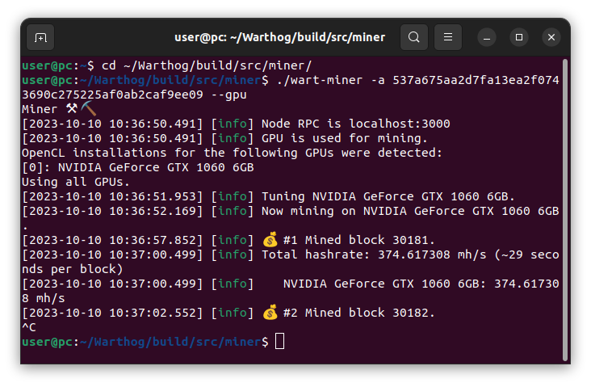
</p>
